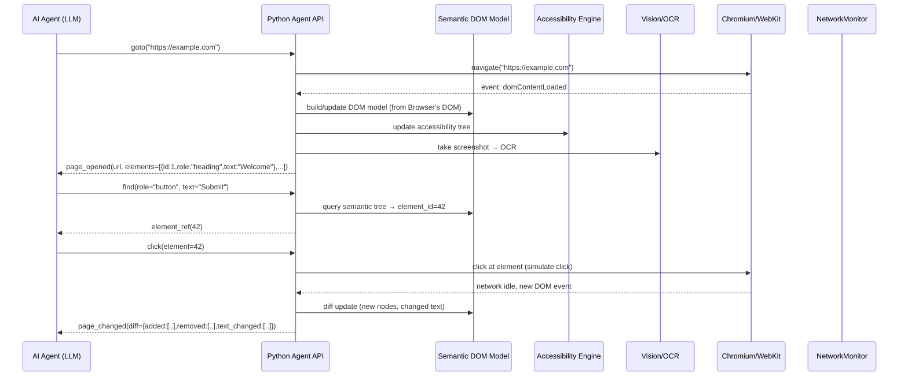
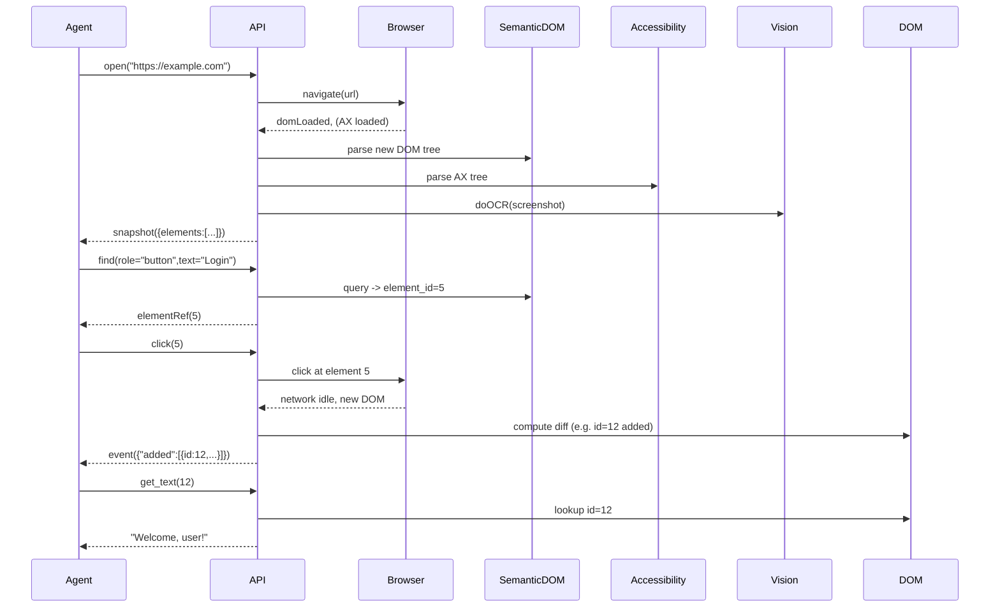

# Designing an AI‑Agent‑First Browser (Python-centric)

**Executive Summary:** In an era where LLMs and autonomous agents increasingly drive web interactions, traditional human‑centred browsers fall short. We propose an **AI Agent‑First Browser**: a Python‑based system that exposes the web as a continuous, semantic “world model” rather than raw HTML or pixels. Its goal is to let agents query and act on pages via high‑level concepts (objects, roles, actions) with minimal token overhead. Key features include a *semantic DOM* merged with accessibility/vision data, stable numeric element IDs, incremental DOM diffs, built‑in OCR/vision, network/API introspection, event streaming, planning and memory, and strong anti‑bot and privacy protections. 

Target users are AI developers, researchers, and enterprises building autonomous web agents or RPA pipelines. Success will be measured by task completion rates, robustness (few failures on dynamic sites), latency per action, and efficiency (e.g. tokens per page). For example, a 90% or higher task success rate on common workflows, sub‑second navigation latency, and >90% data coverage would be goals.  

Key threats include anti-bot defenses (fingerprinting, CAPTCHAs), privacy leaks, and legal constraints on scraping. We assume agents have legitimate access (e.g. user-owned accounts) and treat fingerprinting/captcha resistance as a first-class feature (as in Rotunda). We will avoid illicit data access (scraping behind paywalls, bypassing proprietary APIs) and comply with robots.txt and GDPR/IP laws; legal review is needed. 

Performance targets are ambitious but open-ended: e.g. navigation latency <500ms per page under normal conditions, incremental updates shipped in milliseconds, throughput of hundreds of pages/sec for batch agents (or real‑time single‑agent interactivity), and token budgets kept to a few thousand tokens per page via aggressive compression. 

Below we detail each component and feature. Citations point to relevant primary sources (Playwright/Chromium docs, Browser.engineering, OCR/vision papers, etc.). Architecture diagrams (Mermaid) and JSON/Python examples illustrate designs. We conclude with a roadmap (milestones, effort, risks). 

## Product Goals and Target Users

- **Goals:** Enable LLM agents to interact with the web as if it were a semantic environment. The browser should provide structured, actionable information (objects, forms, APIs) instead of raw HTML/pixels. We aim to maximize *usable* information per CPU/token, minimize flakiness, and fully integrate with LLM workflows. Key goals:
  - **Rich Semantic Model:** Expose pages as graphs of objects (e.g. “Product”, “Navbar”, “Button”) with attributes (role, text, state), not just HTML tags.  
  - **Resilient Automation:** Use accessibility/ARIA semantics for locators (role+name) so that minor DOM changes won’t break agents.  
  - **Efficient Context Use:** Compress page state to minimal tokens (e.g. element references and key attributes rather than full HTML).  
  - **Full Interactivity:** Support clicks, typing, navigation, waiting, JS execution – all via high‑level APIs (e.g. `page.click(element_id)`), avoiding fragile selectors.  
  - **Inspector/Discoverability:** Provide inspection tools (e.g. snapshot queries, attribute getters, network inspector) so agents can explore unknown sites.  
  - **Security/Ethics:** Respect user privacy (only allow actions/data the user could see), and be transparent about fingerprinting/fraud measures.

- **Target Users:** LLM/Agent developers, automation engineers, RPA architects, QA/testing teams, and privacy/security researchers. Both individual researchers (via Python library) and enterprises (as a service or packaged tool) could use it. Educational and accessibility-focused groups may also benefit from the semantic model (since it aligns with screen reader concepts). 

- **Success Metrics:** We should define quantitative and qualitative KPIs:
  1. **Task Success Rate:** Percentage of agent workflows completed without human intervention. Aim ≥90% on benchmark tasks (login, search, checkout, etc.).  
  2. **Data Coverage:** Fraction of *meaningful* content captured (e.g. >95% of visible text, >90% of images with alt text).  
  3. **Latency:** End-to-end action latency (time between `click()` and next state) under 500ms in most cases.  
  4. **Token Efficiency:** Average tokens per page snapshot <5000 (down from 50k). For instance, using “Snapshot+Refs” can save ~93% context.  
  5. **Robustness:** Error or block rate (due to CAPTCHAs/fingerprinting) below 5% on popular sites.  
  6. **Resource Usage:** Reasonable CPU/memory per session (e.g. under 500MB RAM, to allow many parallel sessions).  

## Threat Model

- **Anti‑bot Defenses:** The browser must handle bot-detection/fingerprinting. We take cues from Rotunda: *tell the truth about the machine (real GPU, OS), but “fib” about user-variant data (fonts, extensions).* Use realistic input (mouse paths, keystrokes) to avoid timing-tells. Use protocols that do not leak (Rotunda avoids Chrome’s CDP, favoring Firefox’s Juggler API). We also incorporate fingerprinting countermeasures and CAPTCHA detection: e.g. if CAPTCHA appears, pause automation or hand off to user/solver. **Anti-bot detection** should be built-in: the system flags scripts that websites use to fingerprint (Canvas, WebGL, audio, etc.) and neutralizes them as needed (patch JS, emulate human behavior).  

- **Privacy:** The browser will handle user credentials, cookies, forms, etc. Security isolation is critical: each agent session runs in an isolated context (browser profile) so one agent’s cookies/localStorage aren’t mixed with others. We should avoid leaking sensitive state to other agents or logs. Optionally encrypt stored data at rest. Follow least-privilege principles (e.g. if agent is given credentials to a site, only that agent session has them). When intercepting network calls, do so in-memory and allow user to opt-in.  

- **Security:** Standard threats include XSS or malicious scripts on pages. The browser should sandbox content (as normal browsers do). If we embed a JS engine (QuickJS/V8), ensure it is up-to-date (to avoid known JS engine vulnerabilities). The agent API layer should prevent injection: for example, if user passes data to `click("#id; some_stuff")` accidentally, sanitize selectors. We must also secure the inter-process communication (IPC) between Python and browser: use OS pipes or local sockets with authentication.  

- **Compliance:** Many websites have terms-of-service that forbid scraping. As a guideline, agents should be user‑initiated with explicit consent. For large-scale uses, legal review is needed. We should comply with accessibility regulations (ARIA, WCAG), since our model relies on those.  

- **Anti‑Bot/Ethics:** We should not encourage malicious scraping. As part of the tool, we can provide rate-limiting, user‑agent policies, and compliance checks (e.g. obey robots.txt if legal). Because the system can bypass CAPTCHAs, we must be cautious not to abuse that power.

## Legal and Ethical Constraints

We assume agents operate in legal manners. However, potential issues include:

- **Data Rights:** Extracting content might infringe copyright (e.g. aggregating news without license). We should warn users to limit scraping to what they are allowed.  

- **Privacy Regulations:** If agents collect personal data (e.g. health records from patient portals), the system must be used only by authorized users. Logs and storage (memory, snapshots) should be GDPR‑compliant if personal data flows. Users can implement data deletion/TTL policies.  

- **Bot Policies:** Many sites forbid automated access. Legally, the browser might be seen as a “web robot”. We must respect `robots.txt` by default or provide settings to ignore it.  

- **Legal Interception:** Network interception features could capture private API calls. Users must not use this to break encryption or access unauthorized APIs.  

## Performance and Scale Targets

- **Latency:** Aim for <200–500ms end‑to‑end round-trip per action in common scenarios. This includes execution of a click and waiting for resulting state (assumes small compute <100ms in Python + 50ms in browser rendering). We will leverage asynchronous I/O (async/await) to avoid blocking.  

- **Throughput:** A headless deployment should handle tens or hundreds of simultaneous agents. If each browser instance uses ~200MB, a 32GB machine could run ~100 instances. Alternatively, use a cluster of smaller VMs, container orchestration (Kubernetes).  

- **Token Budget:** Many LLMs now have 32k–100k contexts (2025-26), but DOMs can exceed that naïvely. We aim to compress snapshots into a few thousand tokens (often <3k) via semantic filtering and downsampling.  

- **Memory:** The browser should reuse sessions when possible, avoiding reloading the entire engine each command. In a daemon mode (like Agent-browser), warm start ensures ~50ms command latencies.  

- **Staleness Tolerance:** For performance, we may allow a slight staleness in page state (e.g. if page changes constantly, agent can work with last snapshot while updates stream in).  

## System Architecture

Below is a high-level architecture diagram for the proposed browser. It separates the **Python Agent API layer** from the underlying browsers (Chromium/WebKit) and specialized engines for vision/OCR and accessibility. An internal **Event Bus** carries changes/diffs to the agent, and persistent **Memory** stores page snapshots and history. The browser rendering core (Chromium/Firefox) is treated as a backend that supplies raw DOM and graphics; all intelligence is done in Python.  

```mermaid
graph LR
    A[AI Agent (LLM)] -->|JSON-RPC/WS| B[Python Agent Browser API]
    B --> C[Semantic DOM Engine]
    B --> D[Accessibility/ARIA Engine]
    B --> E[Vision/OCR Engine]
    B --> F[Network Monitor]
    B --> G[JS Execution Engine<br/>(QuickJS/V8)]
    B --> H[Planner & Memory & Context]
    B --> I[Anti-Bot / Fingerprint Handler]
    B --> J[Underlying Browser<br/>(Chromium/WebKit via Playwright)]
    C --> J
    D --> J
    E --> J
    F --> J
    G --> J
    J --> B  <!-- Page events, snapshots, network events -->
    I --> J
```

- **Python Agent Browser API**: The main interface (via JSON-RPC or WebSockets) to the agent. Exposes `page.open(url)`, `click()`, `type()`, `snapshot()`, `find()`, etc. (Examples below).  
- **Semantic DOM Engine**: Maintains a high-level DOM tree, merging HTML, CSS, ARIA, and vision data into objects (roles, labels, IDs).  
- **Accessibility/ARIA Engine**: Builds and updates the accessibility tree in parallel (skipping role=none). Provides role/name/state for elements.  
- **Vision/OCR Engine**: Runs OCR on screenshots or detects UI components (optional). Associates text from images (e.g. logo, canvas) back to DOM. E.g. using Tesseract or ML models.  
- **Network Monitor**: Hooks into the browser’s devtools/protocol to capture XHR/Fetch/WebSocket/GraphQL traffic. Provides APIs for `wait_for_api()`, introspection of endpoints.  
- **JS Execution Engine**: A JS runtime (like QuickJS or V8) for running injected scripts in-page (e.g. to evaluate logic or compute stable IDs). We might embed QuickJS (100KB) or V8 (40MB).  
- **Planner & Memory**: Maintains long-term state. Tracks visited URLs, form inputs, action history, and a knowledge graph of objects. Provides LLM with context (`page.context()`).  
- **Anti-Bot Handler**: Monitors fingerprint signals (navigator properties, timing of events) and introduces human-like delays/movements. It also runs on local IP (no proxy) to avoid bot detection.  
- **Underlying Browser**: A real browser instance controlled via Playwright or CDP. Renders pages, fires events. Headless or headful as needed.

Below is a simplified sequence of interactions (mermaid sequence diagram):



## Feature Design and Data Models

Below, we cover each required feature in detail.

### 1. Semantic DOM / Object Model

- **Purpose:** Provide a structured, *meaningful* representation of a page. Rather than raw HTML, agents see a tree of objects with roles (button, link, textbox), labels, states, and relationships. This abstracts away layout divs and irrelevant tags.  

- **Data Model / Schema:** We maintain a table or JSON for each element object. For example:

  | Field          | Type    | Description                                |
  |---------------|--------|--------------------------------------------|
  | `id`          | int     | Unique stable element ID.                  |
  | `role`        | string  | Semantic role (from ARIA/WCAG, e.g. "button").|
  | `type`        | string  | HTML tag (e.g. `input`, `a`).              |
  | `text`        | string  | Visible text content.                      |
  | `attributes`  | dict    | Key-value of attributes (placeholder, href, alt, aria-*).|
  | `value`       | string  | For inputs: current value.                 |
  | `checked`     | bool    | Checkbox/radio state.                      |
  | `visible`     | bool    | Is the element visible on viewport.        |
  | `enabled`     | bool    | Not disabled?                              |
  | `boundingBox` | object  | {x,y,width,height} for screen coordinates.  |
  | `parentId`    | int/null| id of parent element in semantic tree.     |
  | `childrenIds` | list    | ids of direct semantic children.           |
  | `confidence`  | float   | (Optional) confidence if from OCR.         |

  In a database, `Elements(id, page_snapshot_id, role, type, ...)` plus relational links (parent-child). Or store as JSON in a `page_snapshot` table.  

- **Algorithms/Techniques:** Build by walking the DOM:

  1. **Parse DOM + ARIA:** Extract HTML via Playwright and feed into an ARIA filter. Similar to browser’s own accessibility tree, skip nodes with `role="none"` or `display:none`.  
  2. **Merge with ARIA:** Use the Accessibility engine to assign roles and names (Playwright’s `page.accessibility.snapshot()` shows similar structure).  
  3. **Tree Cleanup:** Remove purely layout nodes (divs without role/text) to flatten structure.  
  4. **Integrate OCR/Text:** For nodes like `<canvas>` or ``, run OCR (e.g. Tesseract) to extract text; include it as child text nodes.  
  5. **Compute relationships:** For forms, group inputs and labels; for tables, map headers to cells. This may use heuristics or DOM-structure rules.  
  6. **Stable IDs:** Assign each object a persistent ID (see next section). 

  We may leverage existing tooling: Playwright’s built‑in *accessibility snapshot* API (deprecated in docs but used internally) or use `aria tree` data from Chromium/Firefox.  

- **Dependencies:** Browser engine (Chromium/Firefox via Playwright) for DOM/ARIA. ARIA spec for roles. (Optionally, Axe-core or dequelabs tools). Python DOM parsers (lxml, html5lib).  

- **Performance:** Building the semantic tree can be somewhat heavy. We do it incrementally: when a click/navigation happens, we diff the old tree with the new DOM from the browser, updating only changed parts (see *Incremental Diffs*). This avoids reparsing from scratch.  

- **Failure Modes/Mitigation:** If the page uses shadow DOM or custom elements, our parser must traverse shadow roots. Some dynamic pages may not expose element semantics (e.g. heavy WebGL). Mitigate by falling back to vision: analyze screenshots or canvas with CV models. If ARIA roles are missing, we may fallback to heuristics (e.g. `<button>` as role=button).  

- **Security/Privacy:** The semantic tree exposes page content to the agent, so it should only include what is visible in the page. Hidden inputs, cross-origin frames, or protected content should be omitted unless agent has access rights. 

### 2. Stable Element IDs

- **Purpose:** Provide a persistent handle for each element across operations, avoiding brittle selectors or re-querying by text. This lets agents say `page.click(42)` referring to the element with ID 42, which remains valid while the element exists.  

- **Data Model / Schema:** Each element object (as above) has a unique integer `id` that is stable during a page session. The schema (see above) includes this `id` as primary key. We maintain a mapping `{DOM_node_reference → id}` internally.  

- **Algorithms/Techniques:**  
  - On initial snapshot, assign sequential IDs to all elements (`<link id=1, button id=2, ...>`).  
  - On DOM updates, use *element matching* to keep IDs stable: e.g. if an element’s tag, attributes, and relative position match a previous element, reuse its ID. Techniques like tree-diffing (node identity via XPath+attributes) or embedding a hidden unique attribute (like a generated `data-agent-id`).  
  - Optionally, use [MutationObserver](https://developer.mozilla.org/en-US/docs/Web/API/MutationObserver) or Playwright’s Mutation events to update IDs incrementally.  
  - For shadow DOM / React: can use the element’s in-browser object identity if possible.  

- **Dependencies:** Underlying devtools protocol (CDP or Juggler) to detect element references. The Python layer (or a small injected script) can insert a `data-*` attribute as persistent ID. The stability may leverage ML matching for complex cases, but simpler heuristics (tag+innerText+position) often suffice.  

- **Performance:** Mapping and diffing thousands of elements must be fast. We can hash a node’s XPath+tag+text to match old vs new. Only O(N) per snapshot.  

- **Failure Modes/Mitigation:** Dynamic content that shuffles elements can break the ID mapping. E.g., infinite scroll adding many items may shift indexes. Mitigate by using content fingerprints (hash of subtree) to match identity. Provide an API to refresh snapshot if the agent lost reference.  

- **Privacy:** IDs themselves carry no secret, but refer to the user’s content. They are session‑scoped, not globally enumerable across domains.

### 3. Incremental Diffs

- **Purpose:** Avoid retransmitting the entire page state after every event. Instead, send only changes (added/removed/updated elements) to the agent. This greatly saves tokens and speeds up reasoning.  

- **Data Model / Schema:** We model the page as a time-indexed graph. On each action, we compute a *diff* object, e.g.:

  ```json
  {
    "added":   [{"id": 87, "role":"button", "text":"Login", ...}, ...],
    "removed": [42, 45, ...],  // list of IDs
    "changed": [{"id":10, "text":"2 items","value":25}, ...]
  }
  ```

  This diff JSON can be stored or sent. In a database, we might have an `ElementChanges` table: `(page_id, element_id, change_type, new_value_json)`.

- **Algorithms/Techniques:**  
  - Compare the new semantic DOM to the previous: using element IDs, detect new IDs (added), missing IDs (removed), and for existing IDs check if any key fields changed (text, value, attributes).  
  - Use a diff algorithm like tree-diff (e.g. [virtual DOM diffing](https://en.wikipedia.org/wiki/Virtual_DOM)) or simpler hash-based comparison since we maintain IDs.  
  - For performance, track which parts of the tree were likely affected (e.g., parent of clicked element) to limit work.  

- **Dependencies:** We leverage the in-browser commit/update mechanism concept from Browser.engineering: it maintains two copies of the accessibility tree and sends only changes. Similarly, we keep a “previous snapshot” in memory and diff against it.  

- **Performance:** Diffs are much smaller than full snapshots, so sending them to the agent is efficient. Computing them is usually much cheaper than full parse (O(changes) vs O(total nodes)).  

- **Failure Modes/Mitigation:** If the agent misses an update (e.g. due to network glitch) it may go out of sync. Mitigate by occasionally sending full snapshots or checksums. If an inconsistency is detected (agent references an old ID that got removed), agent can call `page.refresh()` or `snapshot()` to resync.  

- **Privacy:** Diffs may reveal dynamic content changes (e.g. login success/failure), but the agent would have seen them anyway. No new privacy risk beyond the page content itself.

### 4. Vision / OCR Integration

- **Purpose:** Handle content not represented in the DOM (canvas, images, video frames), and provide an alternate *visual* understanding. Agents may need to read text in images or detect buttons drawn on canvas. Vision allows tasks like “find the red button” or “OCR any text”.  

- **Data Model / Schema:** For visual elements (e.g. identified via the DOM or via screen analysis), we store:
  - `OCRText {x,y,width,height,text}` for recognized text regions.
  - `ImageElement {id, boundingBox, labels}` if using an object detector to label UI widgets.
  - Each screenshot or visual frame can be stored (binary or reference) plus extracted overlays.

- **Algorithms/Techniques:**  
  - **OCR:** Use an OCR engine (Tesseract or cloud OCR) on screenshots or on specific ``/`<canvas>` elements. Assign recognized text to a pseudo-element in DOM (role=textImage) or as an attribute (`alt` if missing).  
  - **Object Detection:** Use a pre-trained model (e.g. YOLO variant trained on UI components, or Meta’s Segment Anything) to detect UI objects (buttons, icons). This can add objects with roles to the semantic model.  
  - **Multimodal LLMs:** As an advanced feature, leverage vision-capable LLM (e.g. GPT-5o with vision) to summarize screenshots or answer visual queries.

- **Dependencies:** Tesseract OCR (Python `pytesseract`), Google Vision API (if desired), or OpenAI’s Vision API. For object detection, PyTorch/TensorFlow models (there exist UI element detection datasets). ML models (YOLO UI, CLIP) may require GPU for speed.  

- **Performance:** Running full OCR on every screenshot is slow. Use it selectively (on user request or if the semantic model is missing info). We can pre-filter (e.g. only OCR visible text in `<canvas>`). Vision model inference is expensive; perhaps run it off the main thread or GPU asynchronously.  

- **Failure Modes/Mitigation:** OCR can misrecognize (especially with fancy fonts). We assign low confidence and allow agent to ignore incorrect text. Visual detection can false-positive; we mark objects as “detected” vs “DOM-driven”. Agent should verify via actions.  

- **Security/Privacy:** Screenshots may contain sensitive visuals (auth captchas). We should not OCR sensitive dialogs unless permission is given. We could blur such regions. Also, sending screenshots or OCR to remote services must respect data privacy (local OCR preferred).

### 5. Accessibility Merge (ARIA/AX Tree)

- **Purpose:** Exploit the browser’s built-in accessibility tree to get a “screen-reader view” of the page, which often aligns with semantic intent. Merging DOM with AX-tree filters out noise and ensures key labels/roles are captured.  

- **Data Model / Schema:** The ARIA/A11y tree is similar to semantic DOM, but conceptually separate. We merge it by augmenting each element with ARIA-specific fields: `role`, `name`, `description`, `expanded`, `checked`, etc. For example, Playwright’s `snapshot()` returns JSON with many fields. We might mirror that:

  ```python
  class AccessibilityNode:
      role: str
      name: str
      disabled: bool
      expanded: bool
      focused: bool
      children: List[AccessibilityNode]
  ```

- **Algorithms/Techniques:**  
  - Use the browser’s AX tree (via Playwright’s `page.accessibility.snapshot()` or CDP’s `accessibility.getPartialAXTree`). This gives an OS-filtered view (only “interesting” nodes).  
  - Filter this tree similarly to semantic DOM: e.g. match AX nodes to our element IDs (if same underlying DOM element).  
  - Incorporate AX-derived properties into semantic objects (e.g. if DOM had no aria-label, use AX `name`).  
  - Keep the AX tree updated with diffs like the DOM (browser often does this internally).  

- **Dependencies:** ARIA specification for roles/states. Playwright’s Accessibility API or Chrome/Firefox devtools protocol for ARIA.  

- **Performance:** AX snapshots are generally smaller than full DOM (they exclude purely decorative elements). We can fetch them on demand (e.g. after navigation, or if agent calls `page.accessibility.snapshot()`).  

- **Failure Modes/Mitigation:** Some sites misuse ARIA (empty labels, wrong roles). We should fall back gracefully. If AX snapshot fails (e.g. on some iframes), ignore AX for those parts.  

- **Security:** Similar to DOM merging; no new issues beyond exposing same content in a filtered way.

### 6. Stable Relationship Graph (Context Graph)

- **Purpose:** Maintain a higher-level graph of objects and their relationships (e.g. “Cart” → “Item #5” → “Price $X”, “Quantity”, “Remove Button”). This is beyond the DOM: it’s a knowledge graph useful for reasoning/planning.  

- **Data Model / Schema:** A graph database or set of tables, e.g. `Objects(id, type, attributes)`, `Relations(src_id, dst_id, relation_type)`. For instance, a product card object with relations to its price and buy button.  

- **Algorithms/Techniques:**  
  - **Heuristics/Rules:** Define object types (e.g. form, list, table) and populate relations (table row→cells).  
  - **Semantic Labeling:** Use ML/NLP to infer categories (e.g. cluster elements by labeling them “menu item”, “search bar”).  
  - **Agent Feedback:** The agent may identify relations (e.g. “this field is part of form”), we incorporate that into the graph.  

- **Dependencies:** No standard library; possibly use graph-tool or ORM, or even RedisGraph.  

- **Performance:** Graph maintenance is in-memory mostly. Scale is moderate (thousands of nodes). Persistence (see memory below).  

- **Failure Modes/Mitigation:** Inferred relations can be wrong. Keep confidence scores, allow corrections via agent (e.g. if agent does `connect(obj1, obj2)`).  

- **Security:** The graph may encode user’s browsing context (e.g. which items in cart). It should be kept private to the session.

### 7. Semantic Search / Queries

- **Purpose:** Let agents find elements by meaning, not by selectors. For example: `find(role="button", text_contains="Checkout")` or even natural language queries (“find the primary call-to-action”). This uses the semantic model to avoid brittle CSS queries.  

- **Data Model:** Index the elements by role, labels, text. Possibly build a simple inverted index of words in text/labels. E.g. a table `ElementIndex(word, element_id, frequency)`.  

- **Techniques:**  
  - **Attribute-Based Search:** Query the semantic model for matching fields (role, name, placeholder).  
  - **Full-Text:** For arbitrary text, use an in-memory full-text index (like Whoosh or SQLite FTS).  
  - **AI-Supported Search:** For vague queries (“red button”), use a vision tag or CSS property (color) to filter. Or use an LLM to interpret query and emit attributes.  
  - **Example:** `page.find(role="textbox", label="Email")` uses AX tree. Or `page.find("blue checkout button")` might run a small vision model to confirm a blue element with text “Checkout”.  

- **Dependencies:** None major, can implement with Python structures. NLTK or spaCy could help parse queries.  

- **Performance:** Searching through a few thousand elements is quick (<1ms) with good indexing.  

- **Failure Modes:** Ambiguous or natural language queries might fail. Fallback to plain text search on visible text. If no match, return empty to the agent to handle.

### 8. Event Streaming

- **Purpose:** Rather than polling state, the browser emits real-time events so agents can react immediately. For example, `"element_added"`, `"element_removed"`, `"text_changed"`, `"api_called"`.  

- **Event Schema:** Use JSON messages with fields like `event_type`, `timestamp`, and `data`. Example event JSON:

  ```json
  {"event":"element_added", "timestamp":1690.123,
   "data": {"id":87,"role":"button","text":"Login","boundingBox":{...}}}
  ```

  Other event types: `navigation`, `api_call`, `network_error`, `download_complete`, `dialog_opened`, etc.  

- **Techniques:**  
  - **DOM Mutations:** Hook into MutationObserver in the browser to capture real-time DOM changes, then diff as above and emit.  
  - **Network Hooks:** Use Playwright/CDP to catch XHR/fetch events or route interception to emit `api_request` events.  
  - **User Prompts:** Capture JS dialogs (alert, confirm) and keyboard focus events.  
  - **Polling Fallback:** For things like CSS animation end, if no event, poll the layout as needed.  

- **Dependencies:** Underlying browser event APIs (MutationObserver, Playwright event callbacks). Possibly a message queue (Redis, RabbitMQ) internally if we want agent and browser in different processes.  

- **Performance:** Events are lightweight; the main cost is serializing to JSON. We can batch events or drop redundant ones if agent is slow.  

- **Failure Modes:** High-frequency changes (e.g. live feeds) can overload. We may throttle or aggregate (e.g. “100 elements added”). Also, if agent misses events, state may drift; ensure diff snapshots to reconcile (see above).

- **Security/Privacy:** Since events convey page details, use only in authorized contexts. Hide or filter events for hidden elements or cross-domain frames.

### 9. Action Graph / Provenance

- **Purpose:** Record a graph of all actions the agent took and resulting state changes. This enables audit, undo, and planning analysis. An action graph is a sequence DAG: each node is an `Action` or `Event`, with edges showing causality.  

- **Data Model:** Two tables (or JSON formats):  
  - **Actions:** `(id, type, target_element_id, input_data, timestamp, result_snapshot_id)`. Types: click, type, submit, scroll, network-route, etc.  
  - **Events:** `(id, action_id, event_type, data, timestamp)`, linking to the triggering action.  

  Together they form a graph. We may add `Reverts(action_id)` edges for undo history.

- **Techniques:** For every agent command (click, fill, etc.), log an action. Capture resulting changes via diffs (as events).  

- **Dependencies:** In-memory graph library or just relational DB.  

- **Performance:** Logging should be very fast. Write-ahead logs can persist these for replay.  

- **Failure/Mitigation:** If an action fails or times out, mark it as such. The planner (below) can use this history to avoid loops.

- **Security:** Logs may contain sensitive input (passwords!). Mask or encrypt sensitive fields (e.g. do not store raw password text in clear).  

### 10. Planning and Native LLM Context

- **Purpose:** Provide the agent with context and planning aids. For example, a `page.context(max_tokens=1000)` method returns the most relevant summary of the page state (important elements, form state, errors) ranked for LLM use. Also, provide a simple planner API: the browser can suggest likely next steps (“Plan: click login → fill form → click submit”) using a small embedded LLM or heuristics.  

- **Data Model:** A structured “context object” maybe in JSON:
  ```json
  {
    "title": "Checkout - Store",
    "currentGoal": "Complete purchase",
    "forms": [{"id":3,"fields":["email","card"]}],
    "buttons":[{"id":5,"text":"Submit"}],
    "errors": [],
    "navigationPath": ["Products","Cart","Checkout"]
  }
  ```
  This could be generated by rules or by a fine-tuned LLM.

- **Techniques:**  
  - **Context Extraction:** Rank elements by importance (e.g. H2/H1 as title, “error” class elements as alerts). Provide a textual summary. Could use a small LLM (GPT-4o stub) on the semantic tree.  
  - **Planning:** If given a goal (e.g. from agent), output step-by-step plan with element refs. Possibly call OpenAI with a prompt of current state + goal. E.g. `browser.plan("purchase item")`.  
  - **Token Budgeting:** Truncate least-important parts to fit limits. Use D2Snap-like summarization.  

- **Dependencies:** Possibly a small LLM integration (calling an LLM is out-of-scope, but we provide the API).  

- **Performance:** Generating context or plan may take hundreds of ms if done via LLM; do async. The `max_tokens` parameter controls size.  

- **Failure/Mitigation:** Heuristics/plans may be wrong. Agent should verify actions. Provide an “undo” or “branch” if plan fails.  

- **Privacy:** Context summaries may include sensitive info (field values). The agent already has those, so no new risk beyond storing memory.

### 11. Keyboard/Mouse Automation (Humanized Input)

- **Purpose:** Simulate user interactions with human-like patterns to evade bot checks.   

- **Techniques:**  
  - Use Playwright’s “stepping” mode to move mouse gradually (can integrate an ML model of human trajectories).  
  - Add random small delays between keystrokes (with occasional mistakes and corrections).  
  - Do not teleport cursor; use absolute screen coords.  

- **Dependencies:** The browser’s input automation (Playwright has options for `delay` between keys). For ML-driven paths, a small learned model (Rotunda mentions a custom ML model) can be ported.  

- **Failure Modes:** Slight slowdown; but essential to avoid detection.

- **Security/Ethics:** Use only on agent’s controlled sessions. Doesn’t add new privacy risk.

### 12. Network Intelligence and API Discovery

- **Purpose:** Reveal underlying APIs. For example, if clicking “Load More” triggers a GraphQL query, we should capture that and allow the agent to use it directly (saving the need to click repeatedly).  

- **Data Model:**  
  - **Requests Table:** `(id, url, method, headers, body, timestamp, response_status, response_body_hash)`.  
  - **GraphQL Endpoints:** Detect if request is GraphQL (URL or content type) and parse payload to extract query name and fields.  

- **Techniques:**  
  - Use Playwright/CDP to intercept all network traffic. Log XHR/fetch with full detail. If the agent calls `page.wait_api("/login")`, then pause until a request to `/login` completes.  
  - If GraphQL is detected, introspect schema if allowed (POSTing `__schema` query).  
  - Optionally, implement a mini REST client: e.g. if the agent sees a REST call behind a button, allow `browser.api_call("GET", url)` to replicate it.  

- **Dependencies:** Playwright’s network API. For GraphQL introspection, Python GraphQL libraries.  

- **Performance:** Negligible for logging. Intercepting introduces minimal latency.  

- **Failure Modes:** Some APIs require authentication tokens or cookies which may not persist. We mirror browser context, so API calls should use same cookies.  

- **Security:** Captured APIs may include auth tokens. Secure storage (encrypt logs). Only expose to agent in a controlled way (agent already has page’s cookies).

### 13. Memory and History

- **Purpose:** Retain what the agent did and saw across the session (and optionally across sessions) so it need not re-query trivial facts. This includes visited URLs, form inputs, clicked elements, and user-provided data (with consent).  

- **Data Model:**  
  - **Session Memory DB:** Tables like `VisitedURLs(session_id, url, timestamp)`, `FormInputs(session_id, element_id, value)`, `ActionHistory(session_id, action_json)`, `DialogHistory`, etc.  
  - **Long-term Memory:** (Optional) a user profile (preferences, frequent items) or site-specific memory (shipping address).  

- **Techniques:**  
  - On each navigation or form fill, log the data. Provide agent access via API `page.memory.get("shipping_address")`.  
  - Summarize memory for context (`browser.memory_summary()`).  
  - Use this memory for autosuggest: if an agent comes to a known login page, browser can auto-fill known credentials (user opt-in).  

- **Dependencies:** A lightweight embedded database (SQLite) or NoSQL (Redis) per session.  

- **Performance:** Very fast (in-memory, indexed by session).  

- **Security:** Encryption and strict scoping (memory for one user/session not exposed to others). Comply with privacy: do not retain PII longer than needed. Allow agent/user to clear memory.

### 14. Replay / Undo

- **Purpose:** Allow deterministic replay of sessions for debugging, or branching exploration. For example, the agent can “snapshot” and try alternate actions (`undo()` to go back).  

- **Data Model:** The full action log plus diffs and page snapshots allows reconstructing any state. We store snapshots periodically (or deltas to reconstruct on-the-fly).  

- **Techniques:**  
  - **Checkpointing:** After each navigation, save a full DOM state (or compressed snapshot). For small changes, rely on action log to rewind.  
  - **Command Log:** All agent commands and browser events are logged. A `replay()` function replays them in order.  
  - **Branching:** The agent can fork the session: clone the browser state (if supported, e.g. WebKit can save a session), then diverge.  

- **Dependencies:** Underlying browser support for saving/restoring state (session storage cookies).  

- **Performance:** Some overhead for snapshotting. For short replays, fast; long session replay might take seconds.  

- **Security:** Careful that replay doesn’t re-submit destructive actions (like purchases). 

### 15. Token Compression

- **Purpose:** Aggressively reduce the token size of snapshots and context. Raw DOM/HTML can be 10s of thousands of tokens; we aim for ~3k. Techniques include filtering, summarization, and D2Snap algorithm.  

- **Techniques:**  
  - **Downsampling (D2Snap):** As in Schiepanski et al. (2025), merge/omit low-level elements to keep UI features. Consolidate containers by ratio *k*, filter out low-importance text (TextRank), drop unimportant attributes below threshold *m*. This yields a valid, smaller DOM.  
  - **Semantic Compression:** Replace groups of elements with a single summary node (e.g. “ProductList[10 items]”).  
  - **Text Summaries:** Summarize long paragraphs into key sentences (using TextRank or LLM).  
  - **Bounding Tokens:** Monitor the token count; if exceeding threshold, apply more aggressive compression (Adaptive D2Snap).  

- **Dependencies:** The D2Snap algorithm itself (we can implement per their pseudocode). NLTK/TextRank for summarizing text nodes.  

- **Performance:** Compression must be fast (sub-second). D2Snap is linear in DOM size.  

- **Failure/Mitigation:** Over-compression can lose info. We flag compressed nodes and allow agent to request “full view” of a region. Also, test on benchmarks to find good k,l,m parameters.  

- **Citations:** Downsampling research shows DOMs can be reduced ~2/3 while retaining agent success rates.

### 16. Native Python API

- **Purpose:** Expose a Pythonic API for agents to use. For example, `page.find(...)`, `page.click(...)`, `page.snapshot()`, etc., without writing JavaScript or CSS selectors.  

- **Examples:**

  ```python
  from agent_browser import Browser
  browser = Browser()  # starts Python layer + browser
  page = browser.new_page()
  page.open("https://store.example.com")
  snapshot = page.snapshot()
  print(snapshot.title, snapshot.scroll_position)
  # Find by semantic
  checkout_btn = page.find(role="button", text_contains="Checkout")
  page.click(checkout_btn)
  page.wait_for_navigation()
  form = page.find(role="form", name="Payment")
  page.fill(form.field("CardNumber"), "4111111111111111")
  page.submit(form)
  # Capturing network calls
  page.route("**/api/**")  
  page.click(page.find("Submit Order"))
  calls = page.network_requests(filter="api")
  print("API calls made:", calls)
  ```
  This illustrates high-level calls.  

- **Dependencies:** Implementation in Python, likely wrapping Playwright or Playwright-like commands.   

- **Performance:** The Python layer adds minimal overhead; critical paths (DOM diffing, etc.) should be in optimized code (C or Rust if needed).  

- **Failure Modes:** The API should raise clear errors (e.g. element not found, timeout) that the agent can catch.  

- **Privacy:** The API should not leak anything except what’s on page or network.

### 17. Multi-Agent Support

- **Purpose:** Allow multiple agents (possibly of different roles) to collaborate on the same session or different sessions. For example, one LLM agent might navigate, another might parse forms, and a third might handle vision tasks.  

- **Data Model:** Sessions are identified. Agents can attach to a session via the API. Shared memory or events can be used for coordination.  

- **Techniques:**  
  - **Isolation:** Each agent gets its own `Browser` instance by default. For collaboration, they could share a `session_id`.  
  - **Shared World Model:** The central state (DOM, events) is maintained centrally; different agents can subscribe to relevant event streams (e.g. "UI agent sees new page, vision agent gets screenshot event").  
  - **Role-Based Agents:** For example, an *Input Agent* fills forms, a *Navigator Agent* clicks links, a *Vision Agent* annotates UI, all via the same API.  

- **Dependencies:** Underlying IPC: if Python multi-threaded, use threading or asyncio. If separate processes, use sockets/IPC.  

- **Performance:** Multi-agent adds concurrency, so ensure thread-safety or use an async model (e.g. FastAPI + WebSocket server for multiple clients).  

- **Failure/Mitigation:** Race conditions are possible if agents give conflicting commands. Implement locking (e.g. one command at a time) or sequence control.  

- **Security:** Ensure agents cannot snoop on each other’s private data unless explicitly shared. 

### 18. Anti-Bot Detection and Evasion

(Expanded from Threat Model)  
- **Purpose:** Proactively detect if a page is testing for bots, and evade it with human-like behavior.  

- **Techniques:**  
  - **Fingerprint Checks:** Before issuing any commands, compute a “bot likelihood” based on features (fast fill times, no mouse movement). If high, slow down actions.  
  - **Humanized Input:** As above (mouse paths, keystroke delays).  
  - **Hardware Emulation:** Run on real hardware (or use dummy hardware metrics) so that `navigator.webdriver` or GPU queries appear normal.  
  - **Local Network:** Use local residential IPs rather than datacenter proxies to avoid IP-based blocks.  

- **Dependencies:** Custom models or heuristics for detection. Possibly integrate OpenAI's safety classifiers to detect “unhuman” patterns.  

- **Performance:** Slight slowdown (add random small delays).  

- **Failure:** If blocked, the agent should either stop or spin up a new session (maybe via a pool of browser instances).

### 19. Predictive State / Prefetch

- **Purpose:** Anticipate likely next steps to prefetch resources or highlight possible actions. E.g., if clicking a “Buy” button likely loads a payment form, pre-open it in a hidden background to save time.  

- **Techniques:**  
  - **Speculative Navigation:** After a click, begin preloading the next page (Playwright can prefetch).  
  - **Suggestion Engine:** Based on past agent behavior or common patterns, flag elements (e.g. a “Confirm” button) as likely actions.  
  - **Adaptive Snapshotting:** If an AJAX call is likely, pre-snapshot after response.  

- **Dependencies:** None specific, but could use small heuristic models (e.g. rank links/buttons by “importance”).  

- **Failure:** Over-prediction wastes bandwidth. We can disable by default or learn from the success of predictions.

### 20. Undo / Rollback

- **Purpose:** Allow the agent to revert to a previous state if an action led astray.  

- **Techniques:** See *Replay*. Provide `browser.undo()` that reverts the last action by reloading a saved snapshot or by executing the inverse action if possible. A safer approach is to reload the previous URL from history (if navigation occurred).  

- **Dependencies:** Snapshotting (as above).  

- **Failure:** Not all actions are undoable (submissions, purchases); agent must use with caution.  

---

## Component Interaction Examples

Here’s a concrete **Python API example** using the proposed system:

```python
from agent_browser import Browser

browser = Browser(headless=False)  # Launches Python layer + Chromium
page = browser.open("https://shop.example.com/product/123")
# Agent wants to add to cart:
snapshot = page.snapshot()  # Semantic snapshot
button = page.find(role="button", text_contains="Add to Cart")
page.click(button)
page.wait_for_network_idle()

# Inspect network calls:
page.route("**/api/cart**")
page.click(page.find("Confirm"))
network_log = page.network_requests(filter="api/cart")
print("Cart API calls:", network_log)

# Fill checkout form:
page.wait_for(role="textbox", label="Email")
page.fill(page.find("Email"), "user@example.com")
page.click(page.find("button", text="Continue"))

# Take final snapshot for agent to parse order confirmation:
final_state = page.snapshot()
```

**Snapshot JSON format:** When `snapshot(format="json")` is called, the browser returns a JSON structure, e.g.:

```json
{
  "url": "https://shop.example.com/checkout",
  "title": "Checkout",
  "scrollPosition": 0,
  "elements": [
    {"id":1, "role":"heading", "text":"Order Confirmation", ...},
    {"id":2, "role":"textbox", "text":"", "placeholder":"Name", "value":"Alice", ...},
    {"id":3, "role":"textbox", "text":"", "placeholder":"Email", "value":"user@example.com", ...},
    {"id":4, "role":"button", "text":"Place Order", "visible":true, ...}
    // ... more elements
  ],
  "alerts":[],
  "dialogs":[]
}
```

This matches Agent-browser’s design and includes roles, labels, etc.

**Event JSON example:** During a click, we might emit:

```json
{"event":"element_clicked","timestamp":1690.456,
 "data":{"element_id":4,"role":"button","text":"Place Order"}}
```

And after navigation:

```json
{"event":"navigation","timestamp":1690.789,
 "data":{"from":"https://shop.example.com/checkout","to":"https://shop.example.com/thankyou"}}
```

**Database Schema (simplified):**

- `PageSnapshots(session_id, snapshot_id, url, title, timestamp, snapshot_json)` – stores full snapshot JSON.
- `Elements(snapshot_id, element_id, role, text, bounding_box, clickable, ... )` – element table (could be JSON blob instead).
- `Actions(action_id, session_id, type, target_element, value, timestamp)`.
- `NetworkRequests(session_id, request_id, url, method, status, timestamp)`.
- `Events(session_id, event_id, type, data_json, timestamp)`.
- `Sessions(session_id, start_time, user_id, ... )`.
- `MemoryItems(session_id, key, value, timestamp)`.

We can index by `element_id`, `action_id`, etc. For example, a `MemoryItems` table might hold `("shipping_address", "123 Main St", t)` after user filled it.

## Threat Model (Revisited): Anti-Bot, Privacy, Security

As noted, anti-bot is addressed by humanization and local execution. Privacy is maintained by isolating sessions and respecting user data. Security of the Python API is crucial: it should validate input from LLM agents (avoid injection). For example, if the agent issues `page.click(xpath=".//a[@href..."]`, ensure the Python layer properly escapes or rejects unsafe selectors.

## System Architecture Diagrams

### Component Diagram

```mermaid
graph LR
  subgraph Agent Side
    A[AI Agent (LLM/Script)]
  end
  subgraph Browser Side (Backend)
    B1[Python Agent API Server] 
    B2[Semantic DOM Engine]
    B3[Accessibility Engine]
    B4[Vision/OCR Service]
    B5[Network Monitor]
    B6[JavaScript Engine (QuickJS/V8)]
    B7[Planner/Memory Service]
    B8[Anti-Bot Module]
    B9[Browser Renderer (Chrome/Firefox)]
  end
  A -->|RPC/WebSocket| B1
  B1 --> B2
  B1 --> B3
  B1 --> B4
  B1 --> B5
  B1 --> B6
  B1 --> B7
  B1 --> B8
  B1 --> B9
  B2 -->|DOM/API| B9
  B3 -->|AX API| B9
  B4 -->|Screenshots| B9
  B5 -->|CDP Hook| B9
  B6 -->|Inject Script| B9
  B8 -->|Behavior| B9
```

### Sequence (Simplified)



## Implementation Roadmap (Milestones, Effort, Risks)

We envision a multi-phase project (~12–18 person-months for MVP, more for full features):

- **M1 (3pm): Foundation** – Base browser API. Integrate Playwright/Playwright-JS; simple Python CLI. Implement basic `open()`, `click()`, `type()`, and raw DOM snapshot. **Risks:** Playwright Python quirks; Selenium alternative.  
- **M2 (2pm): Semantic Model** – Build the semantic DOM/AX merge. Implement role/name extraction and stable IDs. Create initial schema and `snapshot()` JSON. **Risks:** Inconsistent ARIA usage; we mitigate by extensive testing on sample sites.  
- **M3 (2pm): Incremental Diffs & Events** – Implement DOM diffing and event streaming. Use MutationObserver or Playwright’s `on('domcontentloaded')` to diff. **Risks:** Diff algorithm complexity; may need optimized tree diff libraries.  
- **M4 (3pm): Vision/OCR** – Integrate OCR (Tesseract) and vision model for UI elements. Provide `get_text_in_screenshot()` API. **Risks:** Accuracy and performance; mitigate via GPU/async processing.  
- **M5 (2pm): Network Intelligence** – Capture network (XHR/WebSocket) and implement query APIs. Build simple GraphQL introspection. **Risks:** Complex APIs (GraphQL auth, CORS).  
- **M6 (2pm): Accessibilities** – Polish a11y merging, expose Playwright’s `get_by_role` features. Implement `page.get_by_label()`. **Risks:** Performance on large pages; use Playwright’s filtering.  
- **M7 (2pm): Memory & Planner** – Add session history, key-value memory store, and an example planning helper (`browser.plan()`). **Risks:** Complexity of LLM integration; start with rule-based.  
- **M8 (1pm): Anti-Bot and Humanization** – Integrate human-like input (use Playwright’s slowMo, or custom). Setup running with real proxies/IPs. **Risks:** Hard to test anti-fingerprint conclusively; we use known bot-test sites.  
- **M9 (1pm): Multi-Agent & API Extensibility** – Support multiple concurrent connections, design event subscriptions. **Risks:** Concurrency bugs (thread safety). Use asyncio and isolated state.  
- **M10 (2pm): Polish & Testing** – Build extensive test suite, documentation, examples, etc. Security review. **Risks:** Tight timelines; iterative release can help.  

**Total ~18 person-months** for a robust product (could be split among 3–4 engineers over 6–12 months). Key **risks**: websites evolving rapidly (requires maintenance), anti-bot arms race (constant updates needed), legal changes, and LLM performance variability. We mitigate by modular design (swap out components), and by focusing on stability and compliance.

**Milestones Summary:** 

| Mile | Feature                                 | PM  |
|------|-----------------------------------------|-----|
| M1   | Core API + Browser integration          | 3   |
| M2   | Semantic/Accessible DOM, stable IDs     | 2   |
| M3   | Incremental diffs & event streaming     | 2   |
| M4   | Vision/OCR integration                  | 3   |
| M5   | Network/API introspection               | 2   |
| M6   | Accessibility merging & queries         | 1   |
| M7   | Planner, Memory & Context summarization | 2   |
| M8   | Anti-bot/humanized input                | 1   |
| M9   | Multi-agent & orchestration             | 1   |
| M10  | Testing, docs, optimization             | 1   |
|**Total**|**–**                                |**18**|

Each milestone includes design, implementation, and testing. 

In summary, this **AI-Agent-First Browser** rethinks web automation from the agent’s perspective: replace pixels/DOM with objects/relations, static pages with event streams, and fragile selectors with semantic queries. Drawing on research (e.g. Playwright’s AX strategy, D2Snap token reduction, and agent-focused tools), we outline a comprehensive architecture and plan. If built, it could greatly accelerate and stabilize LLM-based web agents while addressing the unique challenges they face.  

